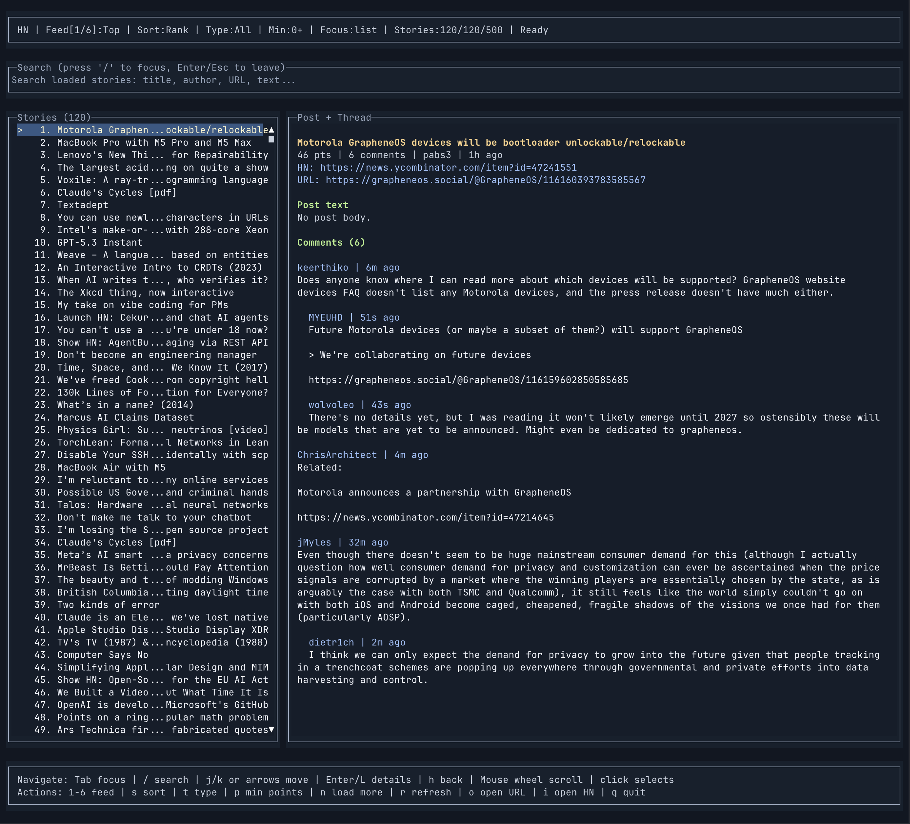

# Hacker News TUI



A full terminal UI for browsing Hacker News using the official [Hacker News API](https://github.com/HackerNews/API) and OpenTUI.

## Features

- Browse feeds: Top, New, Best, Ask, Show, Jobs
- Search loaded stories by title, author, URL, and text
- Filter stories by post class and minimum points
- Sort stories by rank, newest, points, or comment count
- Open article URLs and HN discussion pages from the terminal
- Deep post view with recursively loaded nested comments

## Install

```bash
bun install
```

## Run

```bash
bun dev
```

Run from npm with Bun:

```bash
bunx hackernews-tui
```

Watch mode (auto-restart on file changes):

```bash
bun run dev:watch
```

## Quality Checks

```bash
bun run typecheck
bun run lint
bun run format
bun run test
```

## Publish

```bash
npm login
npm publish --access public
```

## Keybindings

- `Tab`: cycle focus (`list -> detail -> search`)
- `/`: focus search box
- `Esc` / `Enter` (from search): return to story list
- `1-6`: switch feed (`Top, New, Best, Ask, Show, Jobs`)
- `s`: cycle sort mode
- `t`: cycle post type filter
- `p`: cycle minimum points filter
- `j` / `k` or `Down` / `Up`: move through stories
- `Enter` / `l` / `Right`: move focus to detail pane
- `h` / `Left`: move focus back to story list
- `n`: load more stories from current feed
- `r`: refresh current feed
- `o`: open selected story URL (or HN link fallback)
- `i`: open selected HN discussion page
- `q`: quit
